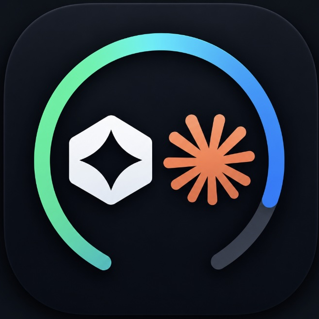

<p align="center">
  
</p>

# LimitChecker

LimitChecker is a private macOS menu bar app for viewing Claude Code and Codex
subscription limits in one place. It uses the CLI sessions already signed in on
your Mac and never asks for, stores, or transmits passwords, API keys, or
access tokens.

## What it shows

- Claude Code: current session and current week
- Codex: five-hour and weekly limit
- Local reset times in German format
- Freshness and failure status for every refresh
- A local twelve-hour history of the primary Claude and Codex windows

The app refreshes once a minute while it is running. A refresh starts both
local CLIs in parallel and normally takes about 10 to 15 seconds.

## Requirements

- macOS 14 Sonoma or newer, Apple Silicon or Intel
- Claude Code CLI installed and signed in with a subscription that exposes
  `/usage`
- ChatGPT for macOS or the standalone Codex CLI installed and signed in with a
  subscription that exposes `/status`

LimitChecker is not affiliated with Anthropic or OpenAI. Both CLIs own their
authentication; each person signs in directly with those tools before opening
LimitChecker. No API key is needed.

## Install

> **Important: macOS will show a security warning for this download.**
> LimitChecker is a free personal open-source project. I have chosen not to
> maintain a paid Apple Developer Program membership, so Apple has not signed
> or notarized the downloadable app. After the first blocked launch, open
> **System Settings > Privacy & Security** and choose **Open Anyway** for
> LimitChecker. You only need to do this once. Only proceed when you downloaded
> the app from this repository and trust it.

Download `LimitChecker-<version>-macos-universal.dmg` from the GitHub Releases
page, open it, then drag `LimitChecker.app` onto the `Applications` shortcut.
The ZIP download remains available for people who prefer to unzip the app and
move it manually.

The app starts a local health check when it launches. If a CLI is missing or
not signed in, it shows which service needs attention without replacing the
other service's last valid values.

Releases state whether they are notarized; see [release instructions](docs/RELEASE.md).

## Privacy and security

All limit reads happen locally. LimitChecker starts the installed CLIs inside a
private empty directory under Application Support so it never loads a project's
configuration or hooks. It stores only timestamped percentage values for the
twelve-hour history at:

`~/Library/Application Support/LimitChecker/history.json`

Read the full [privacy note](docs/PRIVACY.md) and [security policy](SECURITY.md).

## Build from source

```zsh
swift build
python3 -m unittest discover -s tests -v
./Scripts/build-app.sh
open dist/LimitChecker.app
```

`build-app.sh` creates a universal app bundle. It contains the native
`LimitProbe` helper, not Python. Building a notarized distribution is described
in [docs/RELEASE.md](docs/RELEASE.md).

## Contributing

Issues and pull requests are welcome. Please read [CONTRIBUTING.md](CONTRIBUTING.md)
before sending a change.

## License

[MIT](LICENSE)
